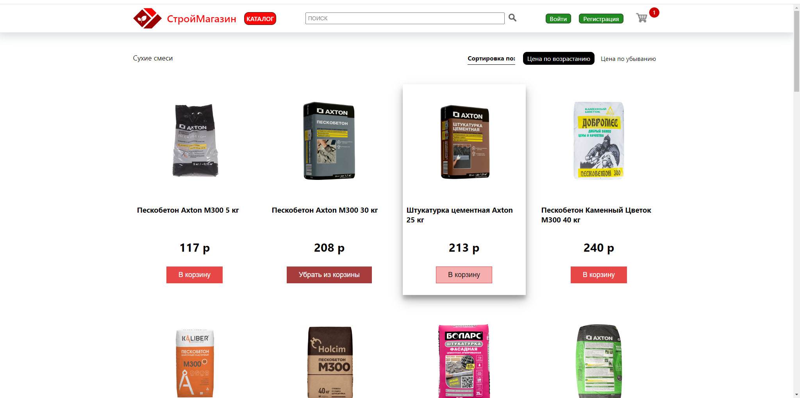

# eCommerce magazin-stroy (MERN)
The website displays products cards. Users can add or remove products to the cart

## Demo website
Demo: [http://62.3.58.148](http://62.3.58.148/)
<br>


## Stack
* Node
* Express
* MongoDB
* React
* Redux
  
## RUN
#### 1. Clone repository
```
$ git clone https://github.com/alexsmith-proff/magazin-stroy.git
```

#### 2. Install MongoDB
Download it from here: [https://docs.mongodb.com/manual/administration/install-community](https://docs.mongodb.com/manual/administration/install-community/)

#### 3. Import DB magazin-stroy(\magazin-stroy\DB\) to MongoDB
Click here [https://www.mongodb.com/docs/compass/current/import-export/#std-label-compass-import-export](https://www.mongodb.com/docs/compass/current/import-export/#std-label-compass-import-export)

#### 4. Run server
```
$ cd server
$ npm install
$ npm run server
```
#### 5. Run client
```
$ cd ..
$ cd client
$ npm install
$ npm run client
```